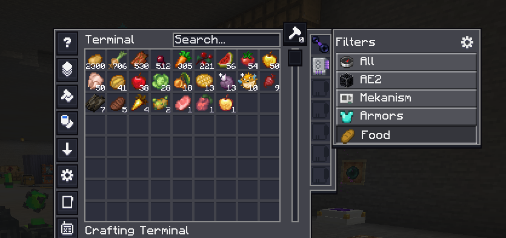

# AE2Organizer

A client-side [Forge](https://minecraftforge.net/) mod that adds user-defined **filter tabs** to Applied Energistics 2 terminals. Create tabs that narrow the ME/Crafting terminal to just the items you want — by mod, item tag, name, or per-stack NBT — and switch between them with one click.

- **Minecraft** 1.20.1 · **Forge** 47.4.x · **AE2** 15.4.x (required)
- **JEI** optional (drag-and-drop in the editor; optional search-bar sync — see [Settings](#settings))

> Building from source, the config-file format, and how the mod works internally live in **[DEVELOPMENT.md](DEVELOPMENT.md)**.

## What it does

AE2 already filters and sorts the terminal list on the client; AE2Organizer hooks into that view, so tabs are purely client-side with **zero server load** — they work even when you connect to a server that doesn't have the mod.

A **"Filters" panel** attaches to the right edge of every ME / Crafting / Pattern / Wireless terminal:

- 🧭 **All** (top of the list) — clears the filter.
- **Your tabs** — click one to filter the terminal to that tab's items. The list scrolls (mouse wheel or the scrollbar) when there are more tabs than fit.
- ⚙ **Gear** (top-right of the panel) — opens the editor.

The panel matches the terminal's height and is drawn with AE2's own GUI style, so AE2 "dark mode" resource packs reskin it too. Its size is adjustable (Settings → **Tab size**). A tab's filter combines with AE2's own search box (AND), so you can pick a broad tab and then type to narrow further.

## Editing tabs

Click the ⚙ gear to open the editor. On the left you add / rename / reorder / delete tabs (the list scrolls); on the right you edit the selected tab (name, icon, match mode, conditions).

Set a tab's **icon** and the item for `mod` / `tag` / `text` conditions in any of three ways:

- **Built-in picker** — click the icon slot or a condition's **`…`** button to open a searchable item grid (works without JEI).
- **Drag from your inventory** — shown along the bottom of the editor.
- **Drag from JEI** — if JEI is installed, its item list appears beside the editor.

What a chosen item does, by condition type: `mod` → its mod id · `text` → its display name · `tag` → opens a list of *that item's* tags to pick from (no need to know tag ids) · the **icon slot** → sets it as the tab icon.

## Tab criteria

Each tab combines its conditions with **Match ANY** (OR) or **Match ALL** (AND):

| Type | Matches | Example |
|------|---------|---------|
| `mod` | items from a mod id | `create` |
| `tag` | items in an item tag | `c:ingots` |
| `text` | display name contains text (case-insensitive) | `sword` |
| `component` | a per-stack NBT check (see below) | — |

Component checks (per-stack NBT):

- `enchanted` — has enchantments (or stored enchantments, for books)
- `named` — has a custom name
- `damaged` — has taken damage
- `custom_data_key` — its NBT contains a given top-level key (the *arg* field)

> **Tag tip (1.20.1):** common tags use the `forge:` namespace on Forge — `forge:ingots`, `forge:nuggets`, `forge:ores`, and so on. Dragging an item onto a `tag` condition lists its real tags, so you don't have to guess.

## Settings

In the editor, click **Settings…**:

- **Reset filter when opening a terminal** — on: every terminal opens on *All*. Off (default): your last active tab is remembered.
- **Show tab names as labels** — on: the bar shows wide labelled buttons. Off (default): icon-only cells with the name on hover.
- **Clear search bar when selecting a tab** — on: clicking a tab also empties the terminal's search box, so the tab's filter starts clean instead of combining (AND) with whatever you'd typed. Off (default): the search text is kept.
- **Sync JEI search bar when selecting a tab** *(needs JEI)* — on: clicking a tab also sets JEI's search to match it, so JEI shows the same things (e.g. pick your "Create" tab and JEI narrows to Create). The tab's conditions become JEI search terms — `mod` → `@mod`, `tag` → `$tag` (JEI 15.x uses `$` for tags), `text` → the name — joined to mirror the tab's **Match ANY** (`|` / OR) or **Match ALL** (space / AND) mode. *Component* conditions have no JEI equivalent and are skipped. Off (default).
- **Tab size** — a slider (with a live preview row) that scales the filter buttons, so you can pack more in or make them easier to read.

Your tabs and settings save automatically, per client. (Where they're stored and the file format: see [DEVELOPMENT.md](DEVELOPMENT.md).)
