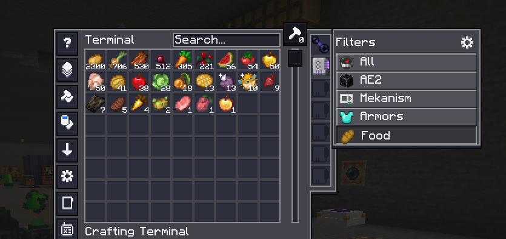

# AE2Organizer

A client-side [NeoForge](https://neoforged.net/) mod that adds user-defined **filter tabs** to Applied Energistics 2 terminals. Create tabs that narrow the ME/Crafting terminal to just the items you want — by mod, item tag, name, or per-stack data component (NBT) — and switch between them with one click.

- **Minecraft** 1.21.1 · **NeoForge** 21.1.x · **AE2** 19.2.x (required)
- **JEI** optional (drag-and-drop in the editor; optional search-bar sync — see [Settings](#settings))

> Building from source, the config-file format, and how the mod works internally live in **[DEVELOPMENT.md](DEVELOPMENT.md)**.

## What it does

AE2 already filters and sorts the terminal list on the client; AE2Organizer hooks into that view, so tabs are purely client-side with **zero server load** — they work even when you connect to a server that doesn't have the mod.

One or more **filter windows** attach to every ME / Crafting / Pattern / Wireless terminal. Out of the box there's a single window docked to the terminal's right edge; you can add more, move them anywhere, and lay each out as a vertical list or a horizontal icon row (see [Windows](#windows)).

Each window shows:

- 🧭 **All** (optional per window) — clears the filter.
- **Your tabs** — click one to filter the terminal to that tab's items; click the active tab again to clear back to All. The list scrolls (mouse wheel or the scrollbar) when there are more tabs than fit.
- ⚙ **Gear** — opens the editor.

Windows are drawn with AE2's own GUI style, so AE2 "dark mode" resource packs reskin them too. A tab's filter combines with AE2's own search box (AND), so you can pick a broad tab and then type to narrow further. Only **one tab is active at a time** across all windows.

## Editing tabs

Click the ⚙ gear to open the editor. The left panel is a **tree**: each *window* node expands to the tabs inside it. Select a window row to edit that [window](#windows); select a tab row to edit the tab (name, icon, match mode, conditions) on the right.

Toolbar: **+Win** (new window) · **+Tab** (new tab in the selected window) · **Copy** (duplicate the selected tab — or the whole window, with its tabs) · **Del** · **▲ ▼** (reorder within the window/among windows). A tab's **"Window…"** button opens a picker to move it to another window. Deleting a window that still has tabs asks first.

Set a tab's **icon** and the item for `mod` / `tag` / `text` conditions in any of three ways:

- **Built-in picker** — click the icon slot or a condition's **`…`** button to open a searchable item grid (works without JEI).
- **Drag from your inventory** — shown along the bottom of the editor.
- **Drag from JEI** — if JEI is installed, its item list appears beside the editor.

What a chosen item does, by condition type: `mod` → its mod id · `text` → its display name · `tag` → opens a list of *that item's* tags to pick from (no need to know tag ids) · the **icon slot** → sets it as the tab icon.

## Tab criteria

Each tab combines its conditions with **Match ANY** (OR) or **Match ALL** (AND):

| Type | Matches | Example |
|------|---------|---------|
| `mod` | items from a mod id | `create` |
| `tag` | items in an item tag | `c:ingots` |
| `text` | display name contains text (case-insensitive) | `sword` |
| `component` | a per-stack data component (see below) | — |

Each condition also has an **`Is` / `Not`** toggle. `Not` turns it into an **exclusion** — anything it matches is *hidden*. Exclusions always apply on top of the positive conditions regardless of the match mode, so a tab reads as *(positives combined by ANY/ALL) and none of the exclusions*. For example: **Match ANY**, `Is tag c:oak_logs`, `Is tag c:spruce_logs`, `Not mod sophisticatedstorage` shows oak **or** spruce wood, but never the storage-mod's drawers. A tab with only `Not` conditions shows everything except those.

Component checks:

- `enchanted` — has enchantments (or stored enchantments, for books)
- `named` — has a custom name
- `damaged` — has taken damage
- `custom_data_key` — its custom data contains a given NBT key (the *arg* field)
- `component_type` — has a given component type id, e.g. `minecraft:potion_contents` (the *arg* field)

> **Tag tip (1.21):** common tags use the `c:` namespace on NeoForge — `c:ingots`, `c:nuggets`, `c:ores`, and so on. The old `forge:` namespace is gone. Dragging an item onto a `tag` condition lists its real tags, so you don't have to guess.

## Windows

Select a window in the editor tree to set its presentation (each property is per window):

- **Layout** — Vertical list or Horizontal icon row (horizontal is always icon-only).
- **Display** — Labels or Icons only (vertical windows).
- **Size** — a per-window scale slider.
- **Gear** — show or hide the editor gear on this window. At least one window always keeps a reachable gear.
- **All entry** — show or hide the 🧭 *All* button on this window.
- **Terminals…** — show or hide this window per **terminal type** (ME Terminal, Crafting Terminal, Pattern Encoding Terminal, …). Each type stands for every terminal of that type.
- **Position** — see below.
- **Export / Import** — copy this window's **tabs** (conditions only — no layout) to the clipboard as JSON, or **replace** them from a copied export (asks first). Handy for sharing a filter set or reusing it in another window.

**Moving windows.** Hold **Shift** in the terminal to drag any window (release to stop), or click **Move…** in the editor for a persistent move mode with a banner. Positions are remembered **per terminal type**: the first terminal you place a window in becomes its base, and other terminals inherit that spot until you drag the window there specifically. **Center here** (window → Position) recenters the window for the terminal you're in.

**Stuck?** The client command `/ae2organizer resetwindows` restores every window to a reachable state — first window docked, the rest centered, all gears shown — and clears per-terminal positions and hides. (Works in singleplayer and on any server; it's client-side.)

## Settings

In the editor, click **Settings…** for cross-cutting behaviour (per-window layout lives on each [window](#windows)):

- **Reset filter when opening a terminal** — on: every terminal opens on *All*. Off (default): your last active tab is remembered.
- **Clear search bar when selecting a tab** — on: clicking a tab also empties the terminal's search box, so the tab's filter starts clean instead of combining (AND) with whatever you'd typed. Off (default): the search text is kept.
- **Sync JEI search bar when selecting a tab** *(needs JEI)* — on: clicking a tab also sets JEI's search to match it, so JEI shows the same things (e.g. pick your "Create" tab and JEI narrows to Create). The tab's conditions become JEI search terms — `mod` → `@mod`, `tag` → `#tag`, `text` → the name — joined to mirror the tab's **Match ANY** (`|` / OR) or **Match ALL** (space / AND) mode. `Not` conditions become JEI exclusions (`-`), applied to every OR branch. *Component* conditions have no JEI equivalent and are skipped — so a `Not component` exclusion can't be mirrored and JEI may show a little more than the terminal. Off (default).
- **Export all / Import all** — copy your **entire** setup (every window *with* its layout, plus all tabs) to the clipboard as JSON, or **replace** everything from a copied export (asks first) — a quick backup or full transfer between instances. Plain JSON; the per-window and all-windows formats are tagged distinctly, so pasting the wrong one just fails safely.

Your windows, tabs, and settings save automatically, per client. (Where they're stored and the file format: see [DEVELOPMENT.md](DEVELOPMENT.md).)
